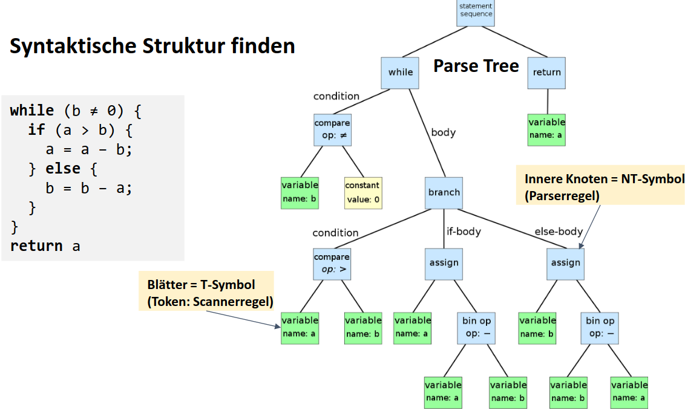

# Compiler Bau

Notizen vom Fach Compiler Bau (COBAU).


## Allgemein

General content

### Literatur

- Compiler:Prinzipien, Techniken und Werkzeuge - Jeffrey D. Ullman
    - Optimierungen
    - Umfangreich aber schwer zu lesen
- The Definitive ANTLR - Terence Parr
- Design Patterns - Erich Gamma, Richard Helm

### Bewertung

- Erstellung von Compiler in 4 Meilensteinen
- Jeder Meilenstein gibt Punkte
    1. Assembler            - 20p 
    2. Syntaktische Prüfung - 30p 
    3. Semantische Prüfung  - 30p 
    4. Codegenerierung      - 40p
- Automatische Systemtests
- Gesamtpunktzahl (max. 120) gibt Note
    - 66p = 4 
    - 114p = 6


## Content

### Assemly 

**Syntax:**
```ass 
mov DEST, SRC
```

**CPU-Befehlsarten**

- Datentransfer
- Arithmethische Operationen
- Sprünge


## EBNF - Extended Backus-Nauer Form

Beschreibt eine Programmiersprache.

Beispiel: 

- _placeholder_ 
- Digit :== "0" | "1" | "2" | "3" | "4" | "5" | "6" | "7" | "8" | "9" |;
- Ident :== Letter { Letter | Digit };
- Zahl = ["-"] { Digit };
    - Gültig: 123, -4, aber nicht: +5, 4.5


## Scanning - Lexikalische Analyse

Scanner (lexer) liest:

- Charakterstream des files 
- Überliest bedeutungslose Zeichen 
- Gliedert die Zeichen in Lexeme und erzeugt pro Lexem ein Token 


## ANTLR - Another Tool for Language Recognition 

- Generiert Scanner und Parser 
- Arbeitet mit EBNF-Definitionen
- Priorität ist nach Reihenfolge der Definition 


current program: 

```ANTLR
grammar Vsl;

// TASK: add each terminal symbol to list of tokens (PROGRAM | DOT | ...)
tokens: (PROGRAM | BEGIN | instruction | END | DOT)* EOF;

instruction: IDENT ASSIGN value SEMICOLON;
value: NUMBER | IDENT | STRING;
IDENT: [A-Z][a-zA-Z0-9]*;

// terminal symbols
PROGRAM: 'PROGRAM';
BEGIN: 'BEGIN';
DOT: '.';
END: 'END';

INSTR: [A-Z][a-zA-Z0-9]* ':=' [a-zA-Z0-9]* ';' ;

SEMICOLON: ';';
ASSIGN: ':=';

STRING: '"' ~["]* '"';
NUMBER: '-'? [0-9]+;

WS: [ \t\n\r] -> skip;

// TASK: Add more terminal symbols
```


### Parser 


Aus tokens vom Scanner einen abstract Syntax tree generieren.



**Important:** 

- Parser kann mit Parse-Tree nicht alles prüfen 
    - Scope von Variablen
    - Typenbereinstimmungen
    - Deklaration von Variablen 

- **Scanner:** Terminalsysmbole
    - Werden nicht mehr weiter angezeigt
    - "if", "else", "<="
- **Parser:** Non-terminalsymbols
    - werden weiter zerlegt
    - Condition, Statement, Expr
- **Parser:** Produktionen 
    - Ableitungsregeln
    - Statement = Designator "=" Expr ";"
- **Parser:** Startsymbol
    - oberstes Non-terminalsymbol 
    - Unit, main, Java, Csharp

### Expressions in VSL 

- Punkt-for-Strich


